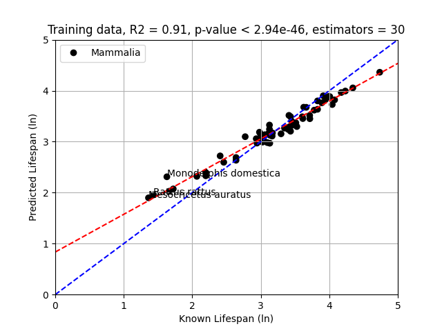

# Agecrack-ng

`Agecrack-ng` is a tool for searching and extracting age-related features from data.

## Run

```bash
# prepare environment
brew install mmseqs2

# clone
git clone git@github.com:moozeq/agecrack-ng.git
cd agecrack-ng

# setup venv
python3 -m venv venv
source venv/bin/activate
pip install -r requirements.txt

# run
./agecrack-ng.py -h
```

```
usage: agecrack-ng.py [-h] [--mode {predictor,ontology,ontology-parse,vectors,prepare,mmseqs-estimation}] [--model {rf,encv,en}] [--filters FILTERS [FILTERS ...]]
                      [--filter-class FILTER_CLASS] [--exclude EXCLUDE [EXCLUDE ...]] [--extract-threshold EXTRACT_THRESHOLD] [--anage ANAGE] [--ncbi NCBI] [--skip]
                      [--count-proteins] [--ontology-plots-freqs] [--reload] [--models-reuse] [--models-params MODELS_PARAMS] [--models-rand MODELS_RAND]
                      [--models-stratify] [--models-bins MODELS_BINS] [--models-plots-show] [--models-plots-unprocess] [--models-plots-annotate]
                      [--models-plots-annotate-threshold MODELS_PLOTS_ANNOTATE_THRESHOLD] [--models-plots-clusters-count MODELS_PLOTS_CLUSTERS_COUNT]
                      [--mmseq-params MMSEQ_PARAMS] [--mmseq-threshold MMSEQ_THRESHOLD] [--mmseq-vectors-mode {count,bool}] [--mmseq-force] [--plot-anage-hists] [-v]

                                                             888                              
                                                             888                              
                                                             888                              
 8888b.   .d88b.   .d88b.   .d8888b 888d888 8888b.   .d8888b 888  888       88888b.   .d88b.  
    "88b d88P"88b d8P  Y8b d88P"    888P"      "88b d88P"    888 .88P       888 "88b d88P"88b 
.d888888 888  888 88888888 888      888    .d888888 888      888888K 888888 888  888 888  888 
888  888 Y88b 888 Y8b.     Y88b.    888    888  888 Y88b.    888 "88b       888  888 Y88b 888 
"Y888888  "Y88888  "Y8888   "Y8888P 888    "Y888888  "Y8888P 888  888       888  888  "Y88888 
              888                                                                         888 
         Y8b d88P                                                                    Y8b d88P 
          "Y88P"                                                                      "Y88P"  
          
Tool for searching and extracting age-related features from data.

optional arguments:
  -h, --help            show this help message and exit
  --mode {predictor,ontology,ontology-parse,vectors,prepare,mmseqs-estimation}
                        Select mode for running the program:
                             - "predictor" gives single best predictor for longevity based on predefined parameters
                             - "ontology" runs analysis for clusters ontology and correlation with longevity
                             - "ontology-parse" parses files obtained in ontology analysis
                             - "vectors" produces additional visualization of species genes vectors
                             - "prepare" download all data, cluster them and prepare for further analysis
                             - "mmseqs-estimation" produces additional plots for mmseqs params estimation
                         (default: predictor)
  --model {rf,encv,en}  ML model (default: rf)
  --filters FILTERS [FILTERS ...]
                        Filters used for extracting proteins sequences, examples in "filters.json" file, when list with empty string is provided (`['']`) - no filtering is applied (default: [''])
  --filter-class FILTER_CLASS
                        Filter species from specific phylo class (e.g. "Mammalia") (default: None)
  --exclude EXCLUDE [EXCLUDE ...]
                        List of excluded species from analysis (default: [])
  --extract-threshold EXTRACT_THRESHOLD
                        Filter out species with count of genes below threshold (default: 1)
  --anage ANAGE         AnAge database file (default: data/anage_data.txt)
  --ncbi NCBI           NCBI eukaryotes database file (default: data/eukaryotes.txt)
  --skip                Skip downloading and extracting part, use it to speed up when trying different models, (option is omitted when running mmseq) (default: False)
  --count-proteins      Count proteins for proper log messages (can impact performance greatly) (default: False)
  --ontology-plots-freqs
                        Show and save plot for clusters frequencies at first 10 places instead importance (default: False)
  --reload              Reload produced files, set when changing thresholds (default: False)
  --models-reuse        Reuse ML models from files if exist (default: False)
  --models-params MODELS_PARAMS
                        Specify params for model as json dict, if not specified the ones from "grid_params.json" will be used (default: None)
  --models-rand MODELS_RAND
                        Random state for splitting data for training and testing (default: 17)
  --models-stratify     Try to stratify dataset using bins (default: False)
  --models-bins MODELS_BINS
                        How many bins for stratifying data, if not specified - number of species divided by 2 (default: 0)
  --models-plots-show   Show plots for each model (default: False)
  --models-plots-unprocess
                        Unprocess data for models predicted plots (default: False)
  --models-plots-annotate
                        Annotate points on models plots with species names (default: False)
  --models-plots-annotate-threshold MODELS_PLOTS_ANNOTATE_THRESHOLD
                        Difference between predicted and known lifespan that should be annotated (default: 0.5)
  --models-plots-clusters-count MODELS_PLOTS_CLUSTERS_COUNT
                        Up to how many most important clusters should be shown on an ontology plot (default: 30)
  --mmseq-params MMSEQ_PARAMS
                        Specify params for mmseqs as json dict, params = "min_seq_id", "c", "cov_mode" (default: {"min_seq_id": 0.8, "c": 0.8, "cov_mode": 0})
  --mmseq-threshold MMSEQ_THRESHOLD
                        Clusters under strength of this threshold will be filter out (default: 0)
  --mmseq-vectors-mode {count,bool}
                        Vectors mode for species, use "bool" to obtain boolean vectors instead of integer vectors with sequences counts (default: count)
  --mmseq-force         Force re-running mmseq (default: False)
  --plot-anage-hists    Plot AnAge database histograms (default: False)
  -v, --verbose         Increase verbosity (default: 0)
```

## Analysis

### Vertebrates

```bash
# best vertebrates predictor
./agecrack-ng.py -vv --mode predictor --model rf --filters repair --mmseq-vectors-mode bool --models-rand 1 --mmseq-params '{"min_seq_id": 0.8, "c": 0.2, "cov_mode": 2}' --models-params '{"n_estimators": 300, "max_depth": 18}'

# plots on unprocessed data
./agecrack-ng.py -vv --mode predictor --model rf --filters repair --mmseq-vectors-mode bool --models-rand 1 --mmseq-params '{"min_seq_id": 0.8, "c": 0.2, "cov_mode": 2}' --models-params '{"n_estimators": 300, "max_depth": 18}' --models-plots-unprocess

# gather multiple models and analyse them all
./agecrack-ng.py -vv --mode ontology --model rf --filters repair --mmseq-vectors-mode bool --models-rand 1 --mmseq-params '{"min_seq_id": 0.8, "c": 0.2, "cov_mode": 2}'
```


### Mammalia

```bash
# best mammalia predictor
./agecrack-ng.py -vv --mode predictor --model rf --filter-class Mammalia --exclude 'Homo sapiens' --extract-threshold 1000 --models-plots-annotate --models-rand 17 --mmseq-params '{"min_seq_id": 0.8, "c": 0.8, "cov_mode": 0}' --models-params '{"n_estimators": 30, "max_depth": 7}'

# plots on unprocessed data
./agecrack-ng.py -vv --mode predictor --model rf --filter-class Mammalia --exclude 'Homo sapiens' --extract-threshold 1000 --models-plots-annotate --models-plots-annotate --models-plots-annotate-threshold 15 --models-rand 17 --mmseq-params '{"min_seq_id": 0.8, "c": 0.8, "cov_mode": 0}' --models-params '{"n_estimators": 30, "max_depth": 7}'

# gather multiple models and analyse them all
./agecrack-ng.py -vv --mode ontology --model rf --filter-class Mammalia --exclude 'Homo sapiens' --extract-threshold 1000 --models-plots-annotate --models-rand 17 --mmseq-params '{"min_seq_id": 0.8, "c": 0.8, "cov_mode": 0}'
```


