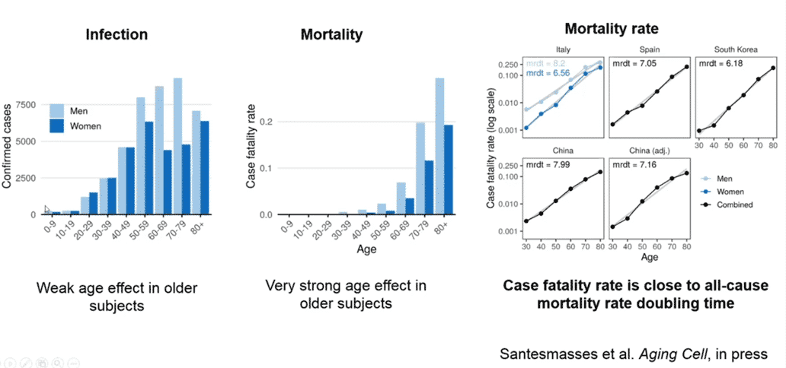
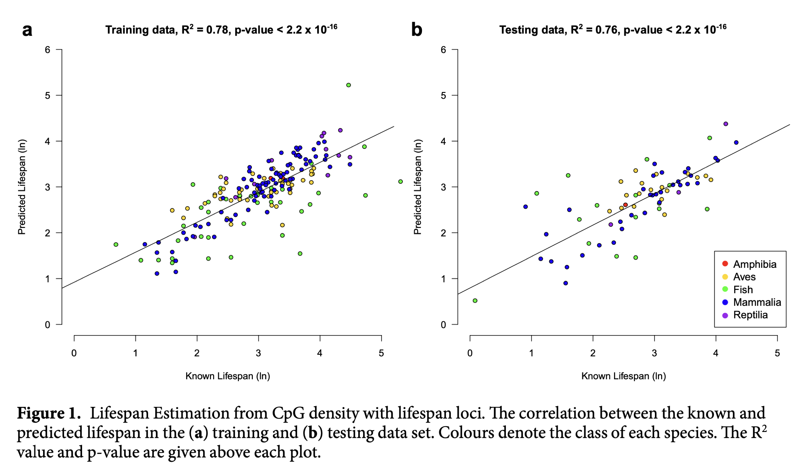
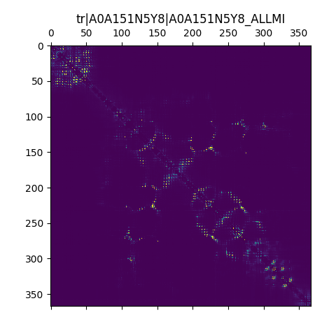
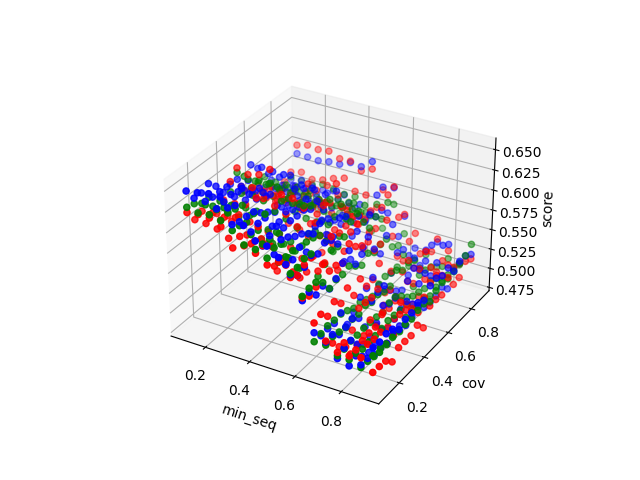
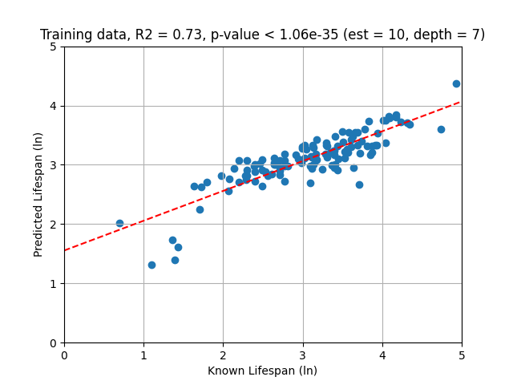
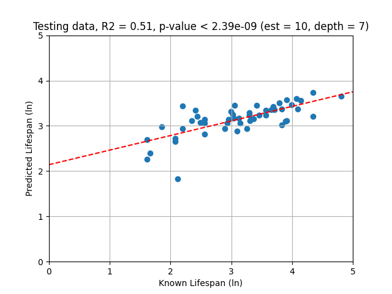

# Report

## Intro

In this project I was at first trying to reproduce results from
publication: [A genomic predictor of lifespan in vertebrates](https://www.nature.com/articles/s41598-019-54447-w), where
scientists based on CpG island density around promoters from genomic data
and [AnAge](https://genomics.senescence.info/species/index.html) database built `glmnet` predictor of lifespan in
vertebrates.

Unfortunately, due to performance and memory limitations I wasn't be able to reproduce their results, so I've tried to
build my own genomic lifespan predictor. Eventually, I achieved a bit worse results, but my predictor can be built very
easily, much faster and doesn't require much memory.

## Purpose

Current data from COVID-19 pandemic gives us some interesting results. The most recent data makes us sure, that in
general, we do not die from diseases, but from being old, which can be easily observed based on mortality when it comes
to COVID-19:

In that case, conducting researches on lifespan, how our maximum age is determined and how can we stay in a health while
being older, may be a highlight of the current century.

Trying to combine genomic data with biological features may be a very challenging task, especially when it comes to data
with some uncertainty (i.e., we don't really know what's an error for lifespans from AnAge database).

## A genomic predictor of lifespan

In previously mentioned paper, researchers obtained around 250 genomes from different vertebrates and checked them
against ~25 thousands of human promoters sequences. In results, they've got CpG islands for each promoter, and then they
measured CG densities around them. Based on that, they combined data into 25k x 250 table with average densities around
promoters and used `glmnet` to select only 44 of them which serve as a genomic predictor. They achieved fine results
when it comes to predicting lifespan in vertebrates:

Unfortunately, I didn't manage to even download all genomes they've used in their study. At first, I thought that they
provided whole table with densities and in that case I'd be able to reproduce their results or try some other method
like `random-forest` instead of `glmnet`. Unluckily, they've only provided table with selected 44 promoter.

I found out that I won't be able to reproduce their results, when I counted how many data I need to download first. I
write some scripts (`ncbi.py`) which match data from AnAge database and genomes from NCBI. In that way, I learned, that
for 250 species' genomes I'd need to download around 1TB of compressed data (I don't even have that much space on my PC,
without mentioning uncompressing that data), and with my internet connection it'd take ~28h.

## A proteomic predictor of lifespan

After failing in reproducing results, I focused on trying to reduce space and performance limitations. Of course, my
main idea was to not use whole genomes. Instead, I've used only proteomes, which reduced space requirements more than
x250 times (from 1TB compressed to 4GB uncompressed data). Proteomes are also easier and faster to compute then whole
genomes, so I was able to run simple analysis on my PC, instead of servers cluster.

My first idea for proteomes, was to:

1. Group certain types of proteins' sequences
2. Try to extract theirs biological features using some pretrained artificial neural network
3. Use that data as an input for training `random-forest` regressor lifespan predictor (with labels as lifespans from
   AnAge database)
4. Predict lifespans for test dataset

I found pretrained, state-of-the-art, [esm neural network](https://github.com/facebookresearch/esm) which allows
transforming proteins' sequences into vectors of floats, representing some biological features. Those vectors can be
presented as images:

Unfortunately, once again, I failed. After extracting groups of proteins for each species responsible for repairing
mechanisms, I had run script for transforming them and learned that for each sequence with a length around 500 amino
acids, transformation takes around 30 seconds. So, I quickly calculated and found out that for all, 9.5 thousands,
repair proteins' sequences, it'll take ~80h. This time, performance limitation.

Before that realization, I obtained some transformed proteins' plots for each species and saw some interesting pattern.
Very similar pictures were showing up in different species, so I thought: what would happen if we cluster those
sequences?

I've checked that way, and it turned out, that it may give me some pretty decent results. All species need some kind of
similar proteins when it comes to critical systems i.e., repairing. So, what about clustering all sequences and check
how many of them are within each group for each species? I quickly created some working script and found out, that
vector with that counts can work pretty well as an input to `random-forest` regressor.

Next step was to determine best clustering parameters, which I've done on repairing proteins dataset:

After that, I just needed to determine `random-forest` regressor hyperparameters and finally obtained, maybe a little
worse, but not that bad, results for repairing proteins dataset:

## Tools and methods

Below, I'd like to present all main tools and methods that I've used:

|tool/algorithm|purpose|
|:---:|:---:|
|AnAge database|obtaining species lifespans for training and testing regressor|
|mmseqs2|clustering amino acids sequences from specified dataset into groups|
|RandomForestRegressor|predicting lifespan of species, trained on vectors with counts for proteins in each cluster|
|esm|neural network for extracting biological features from amino acid sequences|
|NCBI API|matching species from AnAge database and retrieving information about their genomes|
|Uniprot API|matching species from AnAge database and obtaining their proteomes|

## Results

Because creating my proteomic predictor of lifespan in vertebrates is much faster, I've been able to create many of them
from different proteins datasets. They gave me very different results, even considering not optimal hyperparameters.
Eventually, it turned out, that the best results on test data I've obtained from repairing proteins dataset
with `R2 = 0.51` and `p-value < 2.39e-09`. In a table below, I present them across other proteins groups, and their
bests predictors' scores:

|group|R2|p-value|
|:---:|:---:|:---:|
|repair|0.51|2.39e-09|
|membrane|0.43|1.18e-07|
|DNA|0.32|3.95e-07|
|ribosome|0.30|3.03e-05|
|RNA|0.27|4.90e-06|

## Discussion

Such correlation between repair proteins dataset and lifespan predictor may be a good indicator what's most important
when it comes to live to be very old. It confirms the general idea, that repairing proteins are huge factor in all
species' lifespans and their variability may play very important role. Same conclusions may be made for cells signaling,
where membrane proteins act as transmitters and receivers, and allow cells to reproduce or arrest them in case of any
error which is the main mechanism preventing cancer development.